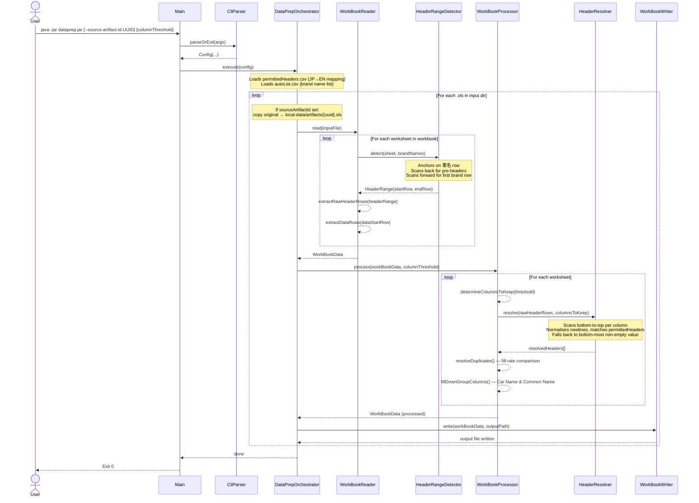

# DataPrep

A lightweight Java CLI tool that pre-processes XLS files produced by Japan's Ministry of Land, Infrastructure, Transport and Tourism (MLIT) fuel economy database. It normalises messy multi-row headers, removes sparse columns, and writes a clean single-header-row XLS ready to be consumed by the [spec-extractor](https://github.com/DylanBrennan92/spec-extractor) application.

Optionally, you can mint a stable **`sourceArtifactId`** (UUID) for a run: DataPrep copies the **original** ministry workbook to `local-data/artifacts/{uuid}.{extension}` before processing, so downstream JSON can point back to the byte-identical source file. Pass the **same UUID** to spec-extractor’s `--source-artifact-id` when extracting from that run’s cleaned `.xls`.

## How It Works

The pipeline runs in four stages:

1. **Read** — `WorkBookReader` opens the XLS workbook, detects the multi-row header range per sheet (anchored to `車名`), and reads all data rows into memory.
2. **Process** — `WorkBookProcessor` drops columns below the fill threshold, resolves the multi-row headers into a single English label using `permittedHeaders.csv`, and removes or deduplicates any remaining duplicate columns using fill-rate comparison.
3. **Write** — `WorkBookWriter` writes the cleaned workbook (one header row + data rows per sheet) to the output path.
4. **Orchestrate** — `DataPrepOrchestrator` wires reader, processor, and writer; when `--source-artifact-id` is set it also **copies** the single input `.xls` into `local-data/artifacts/` first. `Main` parses CLI args via `CliParser` (`ConfigParser` + `ConfigValidator`) and runs the orchestrator.

### Pipeline Sequence Diagram

> Mermaid source and draw.io import instructions: [`src/main/resources/diagrams/dataprep-pipeline.md`](src/main/resources/diagrams/dataprep-pipeline.md)



## Project Structure

```
DataPrep/
├── autoList.csv                   # Canonical Japanese car brand names
├── src/main/java/…/
│   ├── config/          # CliParser, ConfigParser, ConfigValidator, Config, constants, CSV loaders
│   ├── artifact/        # SourceArtifactPaths — artifact filename under local-data/artifacts/
│   ├── input/           # InputWorkbooks — single policy for listing .xls files
│   ├── model/           # Data models: WorkBookData, WorkSheetData, RowData, CarBrand
│   ├── orchestration/   # DataPrepOrchestrator — pipeline entry point
│   ├── processor/       # WorkBookProcessor, HeaderResolver
│   ├── reader/          # WorkBookReader, HeaderRangeDetector, HeaderRange
│   └── writer/          # WorkBookWriter
└── src/main/resources/
    ├── diagrams/
    │   └── dataprep-pipeline.md   # Mermaid sequence diagram + draw.io import guide
    ├── local-data/
    │   ├── input/                 # Place .xls input files here
    │   ├── output/                # Processed output files (same filenames)
    │   ├── artifacts/             # Original XLS copy when --source-artifact-id is set ({uuid}.xls)
    │   └── permittedHeaders.csv   # Japanese → English header mapping
    └── logback.xml
```

## Technology Stack

| Library | Version | Purpose |
|---|---|---|
| Java | 21 | Records, pattern matching, text blocks |
| Apache POI | 5.4.0 | XLS parsing and writing |
| Lombok | 1.18.30 | `@Slf4j`, `@Data` — reduced boilerplate |
| SLF4J + Logback | 2.0.9 / 1.4.14 | Coloured console logging |
| Maven | — | Build and dependency management |

## Prerequisites

- Java 21+
- Maven 3.8+

## Building

```bash
git clone https://github.com/DylanBrennan92/DataPrep
cd DataPrep
mvn clean package
```

The runnable fat-JAR is produced at `target/dataprep-1.0-SNAPSHOT-jar-with-dependencies.jar`.

## Running

**Run from the DataPrep project root.** The application processes all `.xls` files in `src/main/resources/local-data/input/` and writes them to `src/main/resources/local-data/output/` (same filenames). If you pass `--source-artifact-id`, there must be **exactly one** `.xls` in `input/`; the tool copies that file to `local-data/artifacts/` before cleaning.

```bash
java -jar target/dataprep-1.0-SNAPSHOT-jar-with-dependencies.jar [--source-artifact-id <uuid>] [columnThreshold]
```

### Arguments

| Argument | Description |
|---|---|
| `--source-artifact-id <uuid>` | Optional, at most once. When set, `local-data/input/` must contain **exactly one** `.xls`. The original workbook is copied to `local-data/artifacts/<uuid>.<extension>` before processing. Use the same UUID with [spec-extractor](https://github.com/DylanBrennan92/spec-extractor)’s `--source-artifact-id` so JSON output includes `sourceArtifactId` for traceability. |
| `columnThreshold` | Optional. Minimum data fill ratio `0.0–1.0` to keep a column. Default: `0.01` |

### Input/Output

| Location | Purpose |
|---|---|
| `src/main/resources/local-data/input/` | Place your `.xls` source files here |
| `src/main/resources/local-data/output/` | Processed files are written here (same filenames as input) |
| `src/main/resources/local-data/artifacts/` | Original byte copy when `--source-artifact-id` is set — `{uuid}.xls` (or original extension) |

### Column Threshold Guide

| Value | Effect |
|---|---|
| `0.01` | Keep any column with at least 1% fill — recommended for most inputs (default) |
| `0.05` | Keep columns with ≥ 5% fill — removes very sparse annotation columns |
| `0.10` | Keep columns with ≥ 10% fill — more aggressive; may drop sparse-but-valid columns like Car Name |

> The **Car Name** (`車名`) column is always kept regardless of the threshold.

### Examples

```bash
# Process all files in input/ with default threshold (0.01)
java -jar target/dataprep-1.0-SNAPSHOT-jar-with-dependencies.jar

# Process all files with 5% fill threshold
java -jar target/dataprep-1.0-SNAPSHOT-jar-with-dependencies.jar 0.05

# Single workbook + lineage (exactly one .xls in input/)
java -jar target/dataprep-1.0-SNAPSHOT-jar-with-dependencies.jar --source-artifact-id 550e8400-e29b-41d4-a716-446655440000

# Same, with explicit column threshold
java -jar target/dataprep-1.0-SNAPSHOT-jar-with-dependencies.jar --source-artifact-id 550e8400-e29b-41d4-a716-446655440000 0.01
```

### Debug Logging

```bash
java -DLOG_LEVEL=DEBUG -jar target/dataprep-1.0-SNAPSHOT-jar-with-dependencies.jar 0.01
```

## Configuration Files

### `src/main/resources/local-data/permittedHeaders.csv`

Maps Japanese column headers from the source XLS to English output labels. Add a new row whenever a header label in the source file is not being resolved (a `WARN` log is emitted for unmatched labels).

```csv
japanese,english
車名,Car Name
通称名,Common Name
型式,Model Type
...
```

### `autoList.csv` (project root)

Contains the canonical list of Japanese car brand names (e.g. `トヨタ`, `ホンダ`). This is used by `HeaderRangeDetector` to identify where header rows end and data rows begin.

```csv
brand,english
トヨタ,Toyota
ホンダ,Honda
...
```
